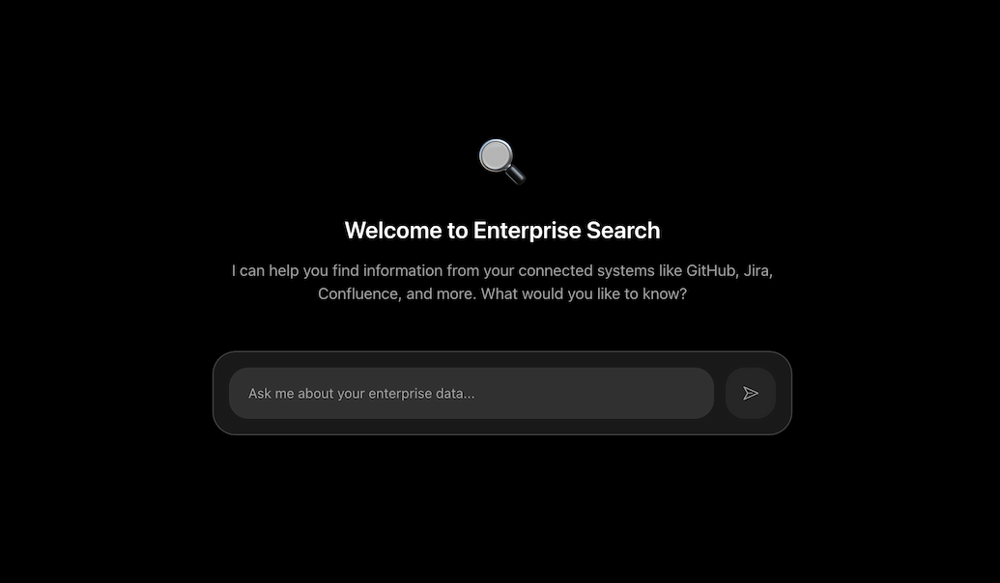

<div align = "center">

<h1><a href="https://github.com/2kabhishek/enterprise-search">enterprise-search</a></h1>

<a href="https://github.com/2KAbhishek/enterprise-search/blob/main/LICENSE">
 </a>

<a href="https://github.com/2KAbhishek/enterprise-search/graphs/contributors">
 </a>

<a href="https://github.com/2KAbhishek/enterprise-search/stargazers">
</a>

<a href="https://github.com/2KAbhishek/enterprise-search/network/members">
 </a>

<a href="https://github.com/2KAbhishek/enterprise-search/watchers">
 </a>

<a href="https://github.com/2KAbhishek/enterprise-search/pulse">
 </a>

<h3>Unified Enterprise Search with MCP Integration 🔍⚡</h3>

<figure>
  
  <br/>
  <figcaption>enterprise-search in action</figcaption>
</figure>

</div>

enterprise-search is an intelligent enterprise assistant that allows teams to query and interact with multiple enterprise systems (Slack, Jira, Confluence, GitHub, Bitbucket) through natural language conversations powered by LLMs and Model Context Protocol (MCP) servers.

## 🏗️ Architecture

### Backend-Heavy Design

```
Frontend (Chat UI) → Backend API → LLM Service + MCP Servers
```

- **Frontend**: Next.js chat interface for natural language queries
- **Backend**: Express.js API handling authentication, MCP management, and LLM integration
- **MCP Layer**: Secure connection to enterprise data sources via MCP servers
- **LLM Integration**: OpenAI/Anthropic/Local models for intelligent responses

### Directory Structure

```
enterprise-search/
├── frontend/          # Next.js web application
├── backend/           # Express.js API server
├── docs/             # Documentation and assets
├── README.md         # Project documentation
└── CLAUDE.md         # Development guidelines
```

## ✨ MVP Features

- **Natural Language Queries**: Ask questions in plain English about your enterprise data
- **Claude LLM Integration**: Powered by Anthropic Claude for intelligent responses
- **MCP Server Support**: Works with any MCP server (GitHub, Jira, Confluence, Slack, Bitbucket)
- **External Configuration**: MCP servers run independently, configured via external JSON
- **Chat Interface**: Clean, responsive chat UI for conversations
- **Simple Backend**: Minimal Express.js API to connect chat to LLM and MCP servers

### 🚧 Future Features (Post-MVP)

- User authentication and sessions
- Conversation history and persistence
- Advanced security and rate limiting
- Team collaboration and shared workspaces
- Database storage for configurations

## ⚡ Setup

### ⚙️ Requirements

- Node.js >= 18.0.0
- npm or yarn
- Docker (optional, for MCP server deployment)

### 💻 Installation

```bash
git clone https://github.com/2kabhishek/enterprise-search
cd enterprise-search

# Install backend dependencies
cd backend
npm install
cp .env.example .env
# Configure your environment variables

# Install frontend dependencies
cd ../frontend
npm install

# Start both services
cd ../backend && npm run dev &
cd ../frontend && npm run dev
```

### 🔧 Environment Setup

#### Backend Configuration (`backend/.env`)

```env
# Server
PORT=3001
NODE_ENV=development

# LLM Service
ANTHROPIC_API_KEY="your-anthropic-key-here"

# CORS
CORS_ORIGIN="http://localhost:3000"
```

#### MCP Server Configuration (`mcp-servers.json`)

```json
{
  "servers": [
    {
      "name": "GitHub",
      "command": "npx",
      "args": ["@modelcontextprotocol/server-github"],
      "env": {
        "GITHUB_PERSONAL_ACCESS_TOKEN": "your-github-token"
      }
    },
    {
      "name": "Jira",
      "command": "npx",
      "args": ["@sooperset/mcp-atlassian"],
      "env": {
        "JIRA_API_TOKEN": "your-jira-token",
        "JIRA_DOMAIN": "your-company.atlassian.net"
      }
    }
  ]
}
```

#### Frontend Configuration (`frontend/.env.local`)

```env
# API
NEXT_PUBLIC_API_URL="http://localhost:3001"
NEXT_PUBLIC_APP_URL="http://localhost:3000"
```

## 🚀 Usage

### Running the Application

#### Development Mode

```bash
# Start backend (Terminal 1)
cd backend && npm run dev

# Start frontend (Terminal 2)
cd frontend && npm run dev
```

#### Production Mode

```bash
# Build and start backend
cd backend && npm run build && npm start

# Build and start frontend
cd frontend && npm run build && npm start
```

#### Testing

```bash
# Backend tests (Jest + Supertest)
cd backend && npm test

# Frontend tests (Jest + React Testing Library)
cd frontend && npm test

# Future: End-to-end tests with Cypress (post-MVP)
```

### Using the Enterprise Assistant (MVP)

1. **Configure MCP Servers**: Update `mcp-servers.json` with your credentials
2. **Start MCP Servers**: Run MCP servers manually in separate terminals
3. **Start the Application**: Launch backend and frontend
4. **Chat**: Ask questions about your enterprise data

#### Example Conversations

```
You: "What repositories do I have access to?"
Assistant: I found 12 repositories you have access to:
- enterprise-search (Private, Updated 2 hours ago)
- web-toolkit (Public, Updated 1 day ago)
- api-gateway (Private, Updated 3 days ago)
...

You: "Show me recent issues in the enterprise-search repo"
Assistant: Here are the recent issues in enterprise-search:
- #23: Add authentication system (Open, created yesterday)
- #22: Fix dark theme toggle (Closed, updated 2 days ago)
- #21: Implement MCP integration (Open, created 3 days ago)
```

### Manual MCP Server Setup

1. **Start GitHub MCP Server**:

```bash
GITHUB_PERSONAL_ACCESS_TOKEN=your_token npx @modelcontextprotocol/server-github
```

2. **Start Jira MCP Server**:

```bash
JIRA_API_TOKEN=your_token JIRA_DOMAIN=company.atlassian.net npx @sooperset/mcp-atlassian
```

3. **Configure in mcp-servers.json**: Update the configuration file to match your running servers

## Getting Started (Development)

This is a [Next.js](https://nextjs.org) project bootstrapped with [`create-next-app`](https://nextjs.org/docs/app/api-reference/cli/create-next-app).

First, run the development server:

```bash
npm run dev
# or
yarn dev
# or
pnpm dev
# or
bun dev
```

Open [http://localhost:3000](http://localhost:3000) with your browser to see the result.

You can start editing the page by modifying `app/page.tsx`. The page auto-updates as you edit the file.

This project uses [`next/font`](https://nextjs.org/docs/app/building-your-application/optimizing/fonts) to automatically optimize and load [Geist](https://vercel.com/font), a new font family for Vercel.

## 🏗️ What's Next

### ✅ MVP To-Do

- [x] Research Model Context Protocol (MCP)
- [x] Design MVP application architecture  
- [x] Choose tech stack (Next.js + Express.js + Claude)
- [x] Set up project structure with frontend/backend separation
- [x] Update documentation with MVP focus
- [ ] Create basic backend API structure with Express.js
- [ ] Implement Anthropic Claude LLM service integration
- [ ] Create MCP client service for external server communication
- [ ] Build simple chat API endpoint
- [ ] Update frontend to simple chat interface
- [ ] Connect frontend chat to backend APIs
- [ ] Create external MCP server configuration file
- [ ] Add basic unit tests for core functionality
- [ ] Test with GitHub MCP server integration

### 🎯 Future Features (Post-MVP)

- **User Authentication**: JWT-based user sessions
- **Database Storage**: Persistent conversation history
- **Multi-LLM Support**: OpenAI, Local Ollama integration
- **Advanced Security**: Rate limiting, input validation
- **Team Collaboration**: Multi-user workspaces
- **Integrated MCP Management**: In-app server configuration

## 🧑‍💻 Behind The Code

### 🌈 Inspiration

enterprise-search was inspired by the need for a unified search experience across fragmented enterprise tools. With the introduction of Anthropic's Model Context Protocol (MCP), we saw an opportunity to standardize how search queries interact with diverse data sources.

### 💡 Challenges/Learnings

- **Protocol Standardization**: Implementing MCP clients for consistent communication with various server types
- **Real-time Aggregation**: Efficiently combining and ranking results from multiple sources
- **Authentication Complexity**: Handling different auth methods across enterprise systems
- **Performance Optimization**: Ensuring fast response times when querying multiple MCP servers

### 🧰 Tech Stack

**MVP Stack:**

- **Frontend**: Next.js 14, TypeScript, Tailwind CSS, Radix UI
- **Backend**: Express.js, TypeScript, minimal API
- **MCP Integration**: Official @modelcontextprotocol/sdk with stdio transport
- **LLM Service**: Anthropic Claude (primary)
- **Configuration**: External JSON file for MCP servers
- **Testing**: Jest, React Testing Library, Supertest
- **Development**: ESLint, Prettier, TypeScript strict mode, Nodemon

**Future Enhancements:**

- User authentication and database storage
- Multiple LLM providers (OpenAI, Local Ollama)
- Cypress for E2E testing
- Advanced security and rate limiting
- Integrated MCP server management

### 🔍 MCP Resources

- [Model Context Protocol Docs](https://modelcontextprotocol.io/) — Official MCP specification
- [Anthropic MCP Guide](https://docs.anthropic.com/en/docs/build-with-claude/mcp) — Implementation guide
- [MCP GitHub Repository](https://github.com/modelcontextprotocol) — Reference implementations
- [Atlassian MCP Server](https://github.com/sooperset/mcp-atlassian) — Jira/Confluence integration

## Learn More

To learn more about Next.js, take a look at the following resources:

- [Next.js Documentation](https://nextjs.org/docs) - learn about Next.js features and API.
- [Learn Next.js](https://nextjs.org/learn) - an interactive Next.js tutorial.

You can check out [the Next.js GitHub repository](https://github.com/vercel/next.js) - your feedback and contributions are welcome!

## Deploy on Vercel

The easiest way to deploy your Next.js app is to use the [Vercel Platform](https://vercel.com/new?utm_medium=default-template&filter=next.js&utm_source=create-next-app&utm_campaign=create-next-app-readme) from the creators of Next.js.

Check out our [Next.js deployment documentation](https://nextjs.org/docs/app/building-your-application/deploying) for more details.

<hr>

<div align="center">

<strong>⭐ hit the star button if you found this useful ⭐</strong><br>

<a href="https://github.com/2KAbhishek/enterprise-search">Source</a>
| <a href="https://2kabhishek.github.io/blog" target="_blank">Blog </a>
| <a href="https://twitter.com/2kabhishek" target="_blank">Twitter </a>
| <a href="https://linkedin.com/in/2kabhishek" target="_blank">LinkedIn </a>
| <a href="https://2kabhishek.github.io/links" target="_blank">More Links </a>
| <a href="https://2kabhishek.github.io/projects" target="_blank">Other Projects </a>

</div>
